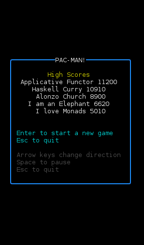

# pmgame

Terminal-based game for Linux similar to Pac-Man and written entirely in Haskell using [Brick](https://hackage.haskell.org/package/brick).



## Installation

### Installing and updating

The program uses the [Haskell Tool Stack](https://docs.haskellstack.org/en/stable/README/). Clone the repository and install with
```sh
git clone https://github.com/MWRuszczycky/pmgame.git
cd pmgame
stack install
```
Stack will tell you where the binary has been installed (e.g., `~/.local/pmgame`). To run the game use
```sh
pmgame
```
To see a list of options try
```sh
pmgame --help
```
To update the game, move to the repository directory and update with
```sh
git pull origin master
stack install
```

### Configuration files

After running the game for the first time, a `~/.config/pmgame` directory will be created in your home directory where high scores are saved. If there is no `.config` file in your home directory, then no directory will be created and the high scores will not be saved between game plays.

### Uninstalling

Delete the `pmgame` binary from wherever Stack installed it (see above). Delete the configuration directory `pmgame` from your `~/.config` directory.

## Controls

* Use the arrow keys, `awsd` (Querty) or `a,oe` (Dvorak) to change direction.
* Use `Esc` to quit the game at any time.
* Use `Space` to pause the game.

## Creating your own mazes

You can create and play your own custom maze as the first level. Complete information, including an example, about how to write your own ascii maze file can be displayed using the help command:
```sh
pmgame --help
```

## Terminal and color issues

When the game runs, it sets the `TERM` environment parameter to `xterm-256color`. If this causes a problem such as a message like
```sh
pmgame : setupTerm: Couldn't lookup terminfo entry "xterm-256color"
```
then you can try using a different terminal setting using the `--terminal` option. For example, try,
```sh
pmgame --terminal=xterm-16color
```
The game should still display correctly with only 16 colors; however, you will start to lose colors if you go below 16. For example, grey text will not show up and power pellets will not flash if you set `--terminal=xterm`, but everything else should still work.
